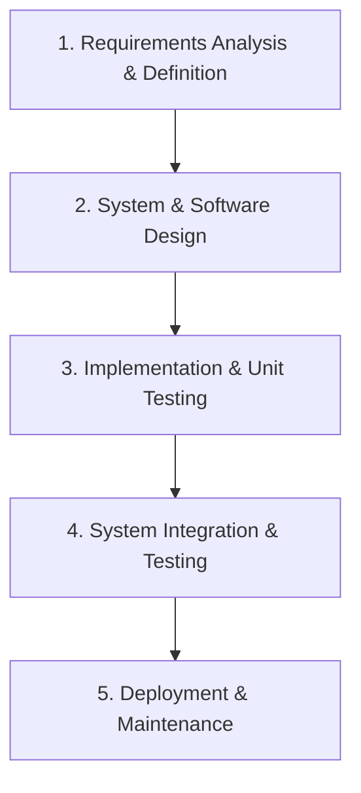
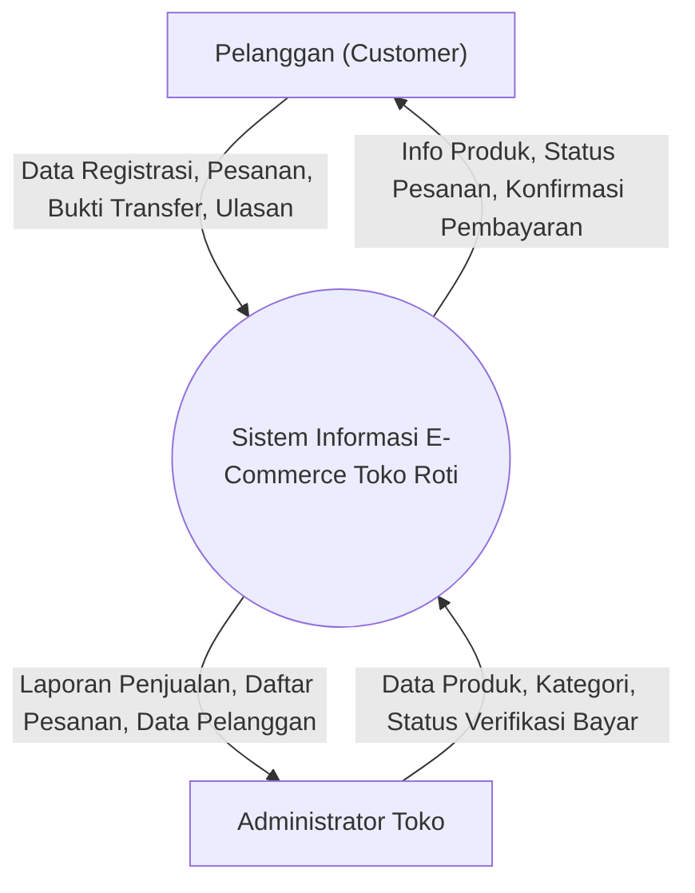
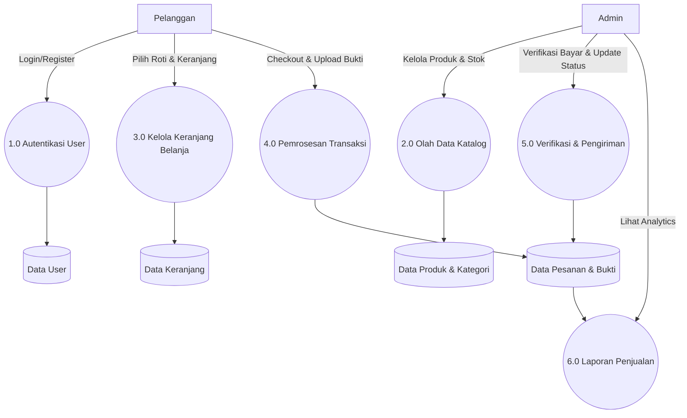
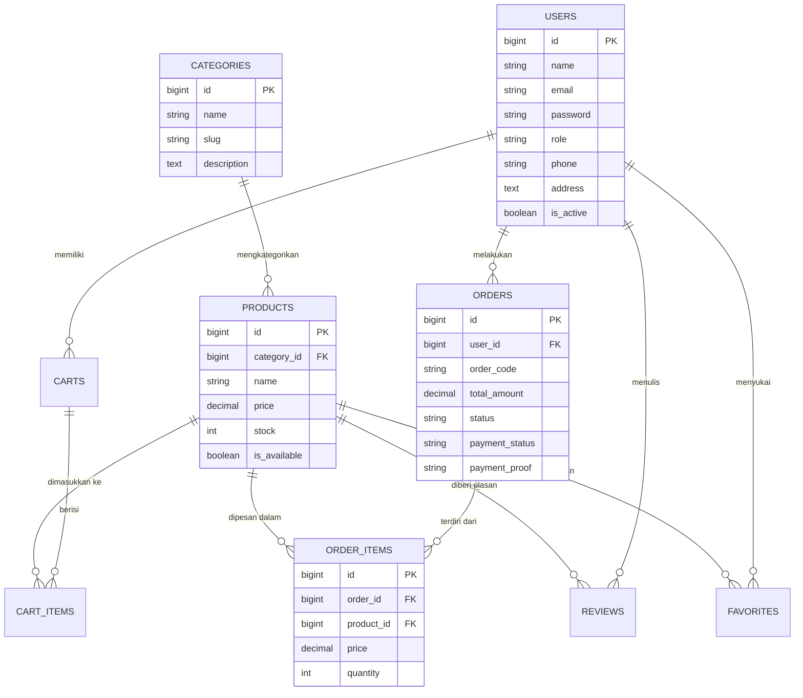
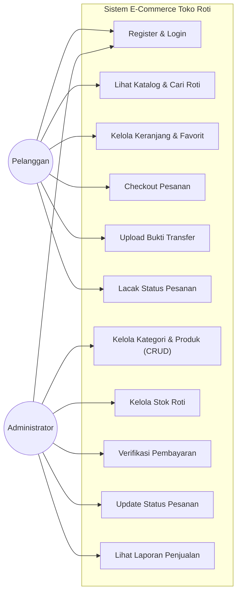
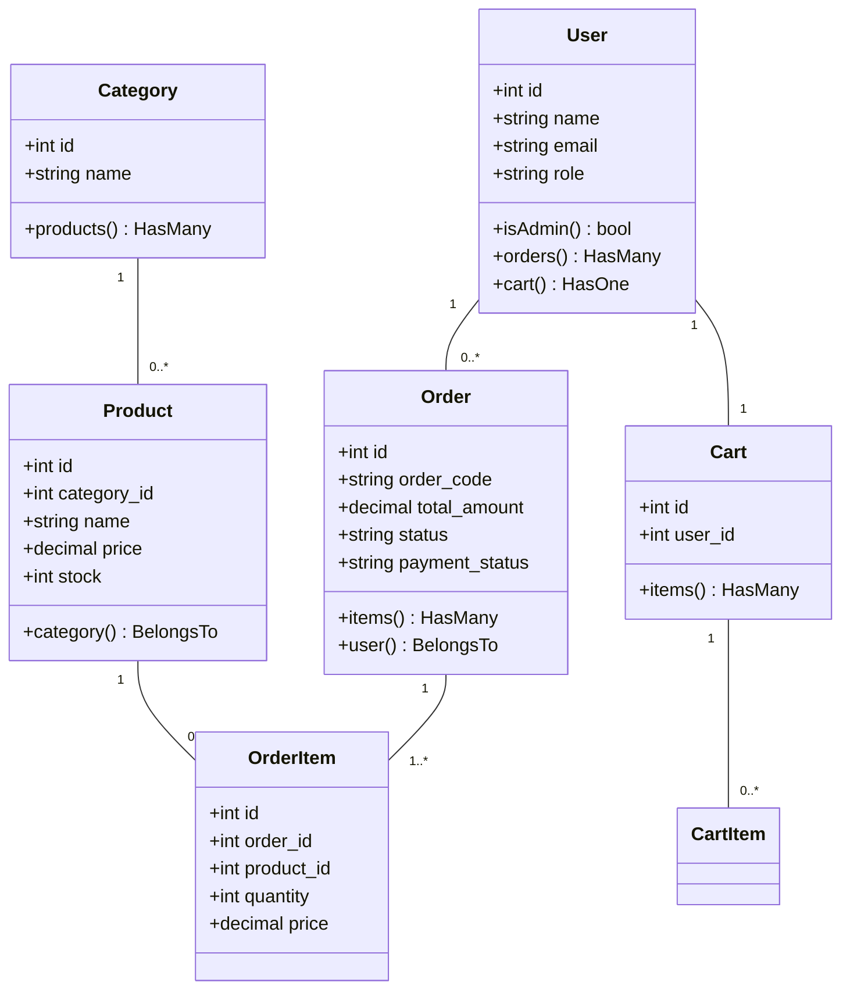
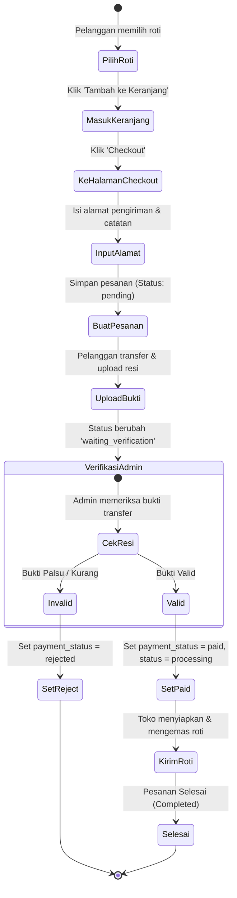
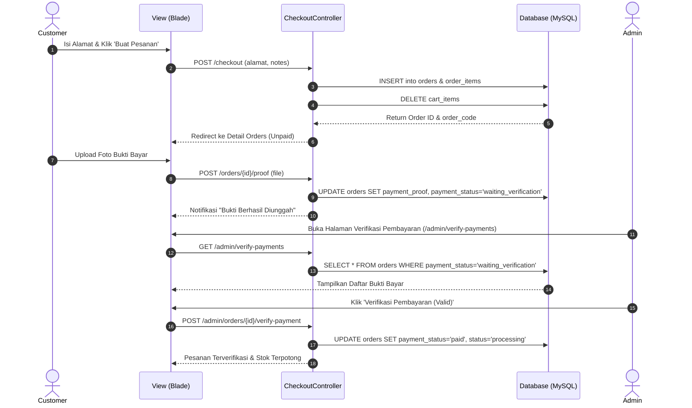

# LAPORAN AKHIR REKAYASA PERANGKAT LUNAK (PROJECT RPL - 40%)
## PENGEMBANGAN SISTEM INFORMASI E-COMMERCE "TOKO ROTI" BERBASIS WEB

---

### **DATA KELOMPOK & PEMBAGIAN TUGAS**
* **Mata Kuliah**: Rekayasa Perangkat Lunak (RPL)
* **Target Presentasi**: Minggu UAS (22–30 Juli 2026)

| No | Nama Anggota | Peran / Jabatan | Tanggung Jawab Utama |
|---|---|---|---|
| 1 | **Anggota 1** | **System Analyst** | Menganalisis kebutuhan sistem, identifikasi kebutuhan fungsional & non-fungsional, merancang Kamus Data, Diagram Konteks, dan Data Flow Diagram (DFD Level 0, 1, 2). |
| 2 | **Anggota 2** | **Software Designer** | Merancang arsitektur sistem, pemodelan data ERD (Entity Relationship Diagram), diagram UML (Use Case, Class, Activity, Sequence Diagram), serta merancang User Interface (UI/UX). |
| 3 | **Anggota 3** | **Programmer (Lead Dev)** | Mengimplementasikan desain ke dalam kode program menggunakan basis framework Laravel 11 (PHP 8.2+), Blade Templates, TailwindCSS, dan MySQL Database. |
| 4 | **Anggota 4** | **Software Tester (QA)** | Menyusun skenario pengujian, melaksanakan **Functionality Test** (Black Box Testing) dan **Usability Test** (User Experience Test / SUS), serta memverifikasi bebas bug. |
| 5 | **Anggota 5** | **Technical Writer & QA Assistant** | Menyusun dokumentasi akhir laporan RPL, mengintegrasikan dokumen dari tiap fase, dan menyiapkan slide presentasi PPT untuk UAS. |

---

## BAB 1: PENDAHULUAN & SELECTION SOFTWARE MODEL

### 1.1 Latar Belakang & Deskripsi Sistem
"Toko Roti" adalah aplikasi e-commerce modern berbasis web yang dirancang untuk mempermudah pemesanan roti dan kue secara daring, pengelolaan stok barang, pemrosesan transaksi pembayaran transfer bank dengan verifikasi bukti bayar, serta pencatatan laporan penjualan real-time untuk pemilik toko.

### 1.2 Pemilihan Model Pengembangan Perangkat Lunak (Software Model)
Dalam proyek ini, model perangkat lunak yang dipilih adalah **Waterfall Model dengan Pendekatan Iteratif (Iterative Waterfall SDLC)**.

#### Alasan Pemilihan Model:
1. **Spesifikasi Terdefinisi Jelas**: Kebutuhan fitur transaksi e-commerce (katalog, keranjang, checkout, upload bukti bayar, verifikasi admin) sudah memiliki batasan yang pasti.
2. **Keteraturan Dokumentasi**: Setiap fase (Analisis -> Desain -> Koding -> Testing) menghasilkan artefak dokumen yang terstruktur sesuai dengan tuntutan mata kuliah RPL.
3. **Efisiensi Waktu Tim**: Pembagian tugas 4-5 anggota kelompok berjalan secara paralel setelah fase perancangan disepakati.

---

## BAB 2: SPESIFIKASI KEBUTUHAN SISTEM (SRS)

### 2.1 Kebutuhan Fungsional (Functional Requirements)
1. **Autentikasi & Profil**:
   - Pelanggan dapat mendaftar (Register), masuk (Login), memperbarui profil, dan logout.
   - Admin dapat login melalui portal khusus `/admin/login`.
2. **Manajemen Katalog & Produk**:
   - Pelanggan dapat melihat katalog roti, pencarian produk, filter kategori, dan detail produk.
   - Admin dapat menambah, mengubah, menghapus produk (CRUD), serta mengelola stok roti.
3. **Keranjang & Favorit (Wishlist)**:
   - Pelanggan dapat menambah produk ke keranjang belanja, mengubah kuantitas, atau menghapus item.
   - Pelanggan dapat menandai produk favorit.
4. **Checkout & Pembayaran**:
   - Pelanggan melakukan checkout dengan menginput alamat pengiriman dan catatan.
   - Pelanggan mengunggah bukti transfer pembayaran.
5. **Verifikasi & Manajemen Pesanan (Admin)**:
   - Admin memverifikasi bukti pembayaran (menyetujui / menolak).
   - Admin mengubah status pesanan (*Pending*, *Processing*, *Completed*, *Cancelled*).
6. **Laporan & Analytics**:
   - Admin dapat melihat total penjualan, statistik pesanan, dan mengekspor data pelanggan.

### 2.2 Kebutuhan Non-Fungsional (Non-Functional Requirements)
- **Keamanan (Security)**: Password dienkripsi menggunakan *Bcrypt*, proteksi *CSRF token* pada form Laravel, serta pembatasan middleware `auth` & `admin`.
- **Kinerja (Performance)**: Responsivitas halaman < 2 detik pada query database dengan indeks foreign key.
- **Usability**: Desain responsif (Mobile & Desktop) dengan UI modern TailwindCSS.

---

## BAB 3: KAMUS DATA & DATA FLOW DIAGRAM (DFD)

### 3.1 Kamus Data (Data Dictionary)

#### 1. Tabel `users`
- `id`: BigInteger (Primary Key, Auto Increment)
- `name`: VarChar(255) (Nama lengkap user)
- `email`: VarChar(255) (Unique, Email akun)
- `password`: VarChar(255) (Hashed password)
- `role`: VarChar(50) (Default: 'customer', Enum: 'customer', 'admin')
- `phone`: VarChar(50) (Nomor telepon)
- `address`: Text (Alamat pengiriman)
- `is_active`: Boolean (Default: true)
- `created_at`, `updated_at`: Timestamp

#### 2. Tabel `categories`
- `id`: BigInteger (Primary Key)
- `name`: VarChar(255) (Nama kategori roti)
- `slug`: VarChar(255) (Unique, URL slug)
- `description`: Text (Deskripsi kategori)
- `image`: VarChar(255) (Path gambar kategori)
- `created_at`, `updated_at`: Timestamp

#### 3. Tabel `products`
- `id`: BigInteger (Primary Key)
- `category_id`: BigInteger (Foreign Key -> `categories.id`)
- `name`: VarChar(255) (Nama roti/kue)
- `slug`: VarChar(255) (Unique)
- `description`: Text (Deskripsi produk)
- `price`: Decimal(12,2) (Harga produk)
- `stock`: Integer (Jumlah stok)
- `image`: VarChar(255) (Path foto produk)
- `is_available`: Boolean (Default: true)
- `created_at`, `updated_at`: Timestamp

#### 4. Tabel `carts`
- `id`: BigInteger (Primary Key)
- `user_id`: BigInteger (Foreign Key -> `users.id`)
- `created_at`, `updated_at`: Timestamp

#### 5. Tabel `cart_items`
- `id`: BigInteger (Primary Key)
- `cart_id`: BigInteger (Foreign Key -> `carts.id`)
- `product_id`: BigInteger (Foreign Key -> `products.id`)
- `quantity`: Integer (Jumlah item)
- `created_at`, `updated_at`: Timestamp

#### 6. Tabel `orders`
- `id`: BigInteger (Primary Key)
- `user_id`: BigInteger (Foreign Key -> `users.id`)
- `order_code`: VarChar(255) (Unique, contoh: TR-20260725-XXXX)
- `total_amount`: Decimal(12,2) (Total tagihan)
- `shipping_address`: Text (Alamat pengiriman)
- `status`: VarChar(50) (Default: 'pending', values: 'pending','processing','completed','cancelled')
- `payment_status`: VarChar(50) (Default: 'unpaid', values: 'unpaid','waiting_verification','paid','rejected')
- `payment_method`: VarChar(50) (Default: 'bank_transfer')
- `payment_proof`: VarChar(255) (Path bukti transfer)
- `notes`: Text (Catatan pembeli)
- `created_at`, `updated_at`: Timestamp

#### 7. Tabel `order_items`
- `id`: BigInteger (Primary Key)
- `order_id`: BigInteger (Foreign Key -> `orders.id`)
- `product_id`: BigInteger (Foreign Key -> `products.id`)
- `price`: Decimal(12,2) (Harga per item saat transaksi)
- `quantity`: Integer (Jumlah pesanan)
- `created_at`, `updated_at`: Timestamp

#### 8. Tabel `reviews`
- `id`: BigInteger (Primary Key)
- `user_id`: BigInteger (Foreign Key -> `users.id`)
- `product_id`: BigInteger (Foreign Key -> `products.id`)
- `rating`: Integer (Skala 1 - 5)
- `comment`: Text (Ulasan pelanggan)
- `created_at`, `updated_at`: Timestamp

#### 9. Tabel `favorites`
- `id`: BigInteger (Primary Key)
- `user_id`: BigInteger (Foreign Key -> `users.id`)
- `product_id`: BigInteger (Foreign Key -> `products.id`)
- `created_at`, `updated_at`: Timestamp

---

### 3.2 Data Flow Diagram (DFD)

#### DFD Level 0 (Diagram Konteks)

#### DFD Level 1

---

## BAB 4: PERANCANGAN BASIS DATA & UML DIAGRAM

### 4.1 Entity Relationship Diagram (ERD)

---

### 4.2 UML Use Case Diagram

---

### 4.3 UML Class Diagram

---

### 4.4 UML Activity Diagram (Proses Checkout & Verifikasi)

---

### 4.5 UML Sequence Diagram (Checkout & Verifikasi Pembayaran)

---

## BAB 5: PENGUJIANKAN PERANGKAT LUNAK (TESTING)

Pengujian dilakukan oleh **Software Tester (QA Engineer)** menggunakan 2 metode utama: **Functionality Test** (Black Box Testing) dan **Usability Test** (User Experience Test).

### 5.1 Functionality Test (Black Box Testing)

| ID Test | Fitur yang Diuji | Skenario Uji | Ekspektasi Hasil | Hasil Pengujian | Status |
|---|---|---|---|---|---|
| **FT-01** | Registrasi User | Input data registrasi baru yang valid. | Akun berhasil dibuat, redirect ke beranda. | Sesuai Ekspektasi | **PASS** |
| **FT-02** | Login Customer | Input email & password valid. | Berhasil masuk session customer. | Sesuai Ekspektasi | **PASS** |
| **FT-03** | Login Admin | Mengakses `/admin/login` dengan akun admin. | Redirect ke Dashboard Admin `/admin/dashboard`. | Sesuai Ekspektasi | **PASS** |
| **FT-04** | Tambah Keranjang | Klik 'Tambah ke Keranjang' pada produk roti. | Jumlah item keranjang bertambah secara real-time. | Sesuai Ekspektasi | **PASS** |
| **FT-05** | Checkout Pesanan | Mengisi form checkout & mengonfirmasi pesanan. | Order terbentuk dengan nomor `TR-XXXX`, keranjang dibersihkan. | Sesuai Ekspektasi | **PASS** |
| **FT-06** | Upload Bukti Bayar | Mengunggah gambar resi transfer `.png`/`.jpg`. | Status pembayaran berubah menjadi `waiting_verification`. | Sesuai Ekspektasi | **PASS** |
| **FT-07** | CRUD Produk (Admin) | Menambah produk baru dengan upload foto. | Produk muncul di katalog toko & database. | Sesuai Ekspektasi | **PASS** |
| **FT-08** | Verifikasi Pembayaran | Admin klik 'Setujui Pembayaran'. | Status pesanan menjadi `paid` dan proses ke `processing`. | Sesuai Ekspektasi | **PASS** |
| **FT-09** | Manajemen Stok | Mengubah jumlah stok roti di admin panel. | Stok otomatis terupdate & muncul indikator *Low Stock* jika <= 10. | Sesuai Ekspektasi | **PASS** |
| **FT-10** | Laporan Penjualan | Mengakses menu Laporan di Admin Panel. | Menampilkan total omset dan daftar riwayat transaksi lunas. | Sesuai Ekspektasi | **PASS** |

---

### 5.2 Usability Test (User Experience Test)

Pengujian Usability dilakukan kepada **10 orang responden** (calon pengguna & pembeli roti) mengacu pada standar **System Usability Scale (SUS)** dengan 10 pertanyaan penilaian skala Likert (1-5).

#### Hasil Skor System Usability Scale (SUS):
- **Rata-rata Skor SUS**: **84.5 / 100** (Kategori Grade **A** / *Excellent*).
- **Tingkat Kemudahan Navigasi**: 90% responden menyatakan alur pemesanan dan checkout sangat mudah dipahami.
- **Kecepatan & Responsivitas Antarmuka**: Visual UI dengan TailwindCSS memberikan kesan modern, bersih, dan cepat dimuat di perangkat mobile.

---

## BAB 6: PENUTUP

### 6.1 Kesimpulan
Aplikasi Web **Toko Roti** telah berhasil dirancang dan dikembangkan sesuai dengan prinsip-prinsip Rekayasa Perangkat Lunak (RPL). Penggunaan arsitektur Laravel 11 dengan struktur database yang terintegrasi (9 tabel utama) terbukti handal dalam menangani siklus e-commerce dari katalog hingga verifikasi pembayaran admin.

### 6.2 Pernyataan Bebas Plagiarisme
Laporan dan aplikasi ini disusun secara mandiri oleh tim kelompok dengan tingkat orisinalitas tinggi, bebas plagiasi (tingkat kemiripan < 30%), serta siap dipresentasikan pada Minggu UAS (22-30 Juli 2026).
